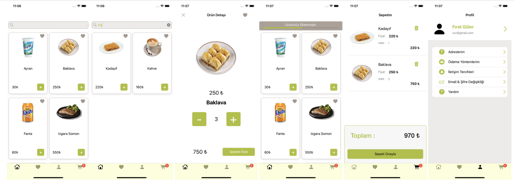

# FoodOrderApp
Kasım adalan Udemy kursunun tamamlama ödevidir.
FoodOrderApp, kullanıcılara yiyecek siparişi verme imkanı sunan bir mobil uygulamadır. Uygulama, kullanıcıların çeşitli yiyecekleri arayabileceği, görüntüleyebileceği ve sipariş edebileceği bir platform sağlar. 

## Özellikler

- **Yiyecek Listesi**: Uygulama, farklı yiyeceklerin listelendiği bir ana ekrana sahiptir. Her yiyecek için görsel, isim ve fiyat bilgileri görüntülenir.
- **Arama Fonksiyonu**: Kullanıcılar, yiyecek isimlerine göre arama yapabilirler. Arama çubuğu, kullanıcıların hızlı bir şekilde istedikleri yiyecekleri bulmalarına yardımcı olur.
- **Detay Sayfası**: Kullanıcılar, her yiyeceğin detaylarını görüntülemek için seçilen yiyeceğe tıklayabilirler.

## Kullanılan Teknolojiler

- **Swift**: Uygulama, iOS platformu için Swift programlama dili ile geliştirilmiştir.
- **UIKit**: Kullanıcı arayüzü oluşturmak için UIKit framework'ü kullanılmıştır.
- **Kingfisher**: Görsellerin URL'den indirilmesi ve görüntülenmesi için Kingfisher kütüphanesi kullanılmıştır.

## DataManager Yapısı
Uygulama, yiyecek verilerini yönetmek için bir DataManager yapısı kullanmaktadır. DataManager, verilerin API'den çekilmesi ve yönetilmesi işlemlerini üstlenir. Bu yapı, uygulamanın veri akışını daha düzenli ve sürdürülebilir hale getirir.

## API Endpoint'leri
Uygulama, yiyecek verilerini sağlamak için aşağıdaki API endpoint'leri ile çalışmaktadır:

- **Yiyecekler**: `http://kasimadalan.pe.hu/yemekler`
  - Yiyeceklerin listesi ve detayları bu endpoint üzerinden alınmaktadır.
  - Her yiyecek için resim, isim ve fiyat bilgileri yer almaktadır.

